<p align="center">
  
</p>

<p align="center">
  
</p>

<p align="center">
  <a href="https://linkedin.com/in/simran-govil"></a>
  <a href="https://leetcode.com/u/simranzz"></a>
  <a href="mailto:simrangovil4@gmail.com"></a>
  
</p>

<br/>

## 👓 `$ cat about_me.txt`

> **hi, i'm simran.** i make AI models smaller, faster and smarter than your situationship.
>
> rn i'm teaching cameras to *see things* at **C-DOT** 👁️. before that i walked into **Adobe**, made their on-device model **84% faster** and **67% smaller**, and walked out with a **patent**. casual.
>
> i don't do `hello world`. i do `hello prod`. 🚀

<p align="center">
  
</p>

<br/>

## 📺 the lore

<p align="center">
  
</p>

<details>
<summary><b>🍿 watch the full episodes (click)</b></summary>
<br/>

#### `EP.04` 👁️ C-DOT: Vision Awakens · *AI/ML Intern · Sep 2026 → now* 
- building an **AI camera surveillance system** for real-time object + anomaly detection
- CV models running on **multiple live video streams** at once
- automating detection so humans can stop staring at 40 screens

#### `EP.03` 🧠 The Adobe Arc · *Product (SWE) Intern · May → Jul 2026*
- built an **end-to-end training pipeline for on-device Small Language Models** that run on potato-tier hardware
- fused **LoRA fine-tuning + Lagrange-multiplier alignment** into one reusable, prod-ready workflow
- 📜 **internal patent granted:** *Systems and Methods for Improving Creative Suggestion Quality Across Preference Categories*
- senior-director sign-off → **shipped to prod** → **−84% inference latency**
- **−67% model size** via structured Quantization-Aware Training
- curated a legally vetted **6,000+ line** dataset and a **20+ metric** eval framework the team now benchmarks with
- presented to **10+ cross-functional stakeholders** (zero nerves, allegedly)

#### `EP.02` 🏆 The Hackathon Arc · *Goldman Sachs Hackathon 2025*
- **top 21 out of 9,000+**. that's the whole episode. it slaps.

#### `EP.01` 💻 The CoreIP Prologue · *Software Dev Intern · May → Jun 2024*
- shipped **5+ responsive pages** with dynamic components + REST integrations
- Figma → pixel-perfect, cross-browser tested

</details>

<br/>

## 🎒 inventory — legendary loot

<table>
<tr>
<td width="50%" valign="top">

### 🤟 [Mudrika](https://github.com/simrangovil/MUDRIKA-app)


**speak → it signs back. with feelings.** 🎭
real-time voice → **American Sign Language** on an **emotion-aware 3D avatar**. Vosk transcription + DistilBERT emotion classifier at **87% accuracy**, driving **20+ hand-made Blender** sign animations.


</td>
<td width="50%" valign="top">

### 🧬 [Canonical Profile Engine](https://github.com/simrangovil/canonical-profile-engine)


**messy data walks in. one clean identity walks out.**
`detect → extract → normalize → match → score → emit`
merges CSV, JSON, PDF/DOCX & API records with per-field confidence at **~6,000 records/sec**. **74 tests**, mypy-strict, ruff-clean. *we don't ship vibes, we ship types.*


</td>
</tr>
<tr>
<td width="50%" valign="top">

### 🚌 [BusTicket Booking](https://github.com/simrangovil/BusTicket-Booking)


**double-booking? not on my watch.**
MERN app with real-time seat picking, Redux state and **seat-lock logic** that stays correct under concurrent chaos.


</td>
<td width="50%" valign="top">

### 🔊 [Voiceify](https://github.com/simrangovil/Voiceify)


**your docs, but make them talk.**
gives a voice to texts, paragraphs and whole documents.


**side quests:** [social-book-platform](https://github.com/simrangovil/social-book-platform) · [AutoColdMailSender](https://github.com/simrangovil/AutoColdMailSender)

</td>
</tr>
</table>

<br/>

## ⚔️ equipped gear

<p align="center">
  <br/>
  <sub><b>spells</b> · languages</sub>
</p>

<p align="center">
  <br/>
  
  
  
  
  <br/>
  <sub><b>legendary weapons</b> · AI / ML</sub>
</p>

<p align="center">
  <br/>
  <sub><b>armor</b> · web & mobile</sub>
</p>

<p align="center">
  <br/>
  <sub><b>utility belt</b> · tools</sub>
</p>

<br/>

## 📈 xp tracker

<p align="center">
  
  
</p>

<p align="center">
  
</p>

<p align="center">
  <picture>
    <source media="(prefers-color-scheme: dark)" srcset="https://raw.githubusercontent.com/simrangovil/simrangovil/output/snake-dark.svg"/>
    <source media="(prefers-color-scheme: light)" srcset="https://raw.githubusercontent.com/simrangovil/simrangovil/output/snake-light.svg"/>
    
  </picture>
</p>

<br/>

<details>
<summary><b>🎮 side quests (click if ur curious)</b></summary>
<br/>

```js
const simran = {
  guildMaster:  "Algobyte — led a 75+ crew, ran 20+ events",
  glowUp:       "+96% club participation. numbers don't lie",
  nss:          "teaching & literacy drives, real-world patch notes",
  dsa:          "500+ problems solved. leetcode is my cardio",
  vibe:         "nerdy. caffeinated. lowkey building something crazy",
  dmsOpenFor:   ["ML / SWE roles", "research collabs", "hackathon squads"],
};
```

</details>

<p align="center">
  
</p>
